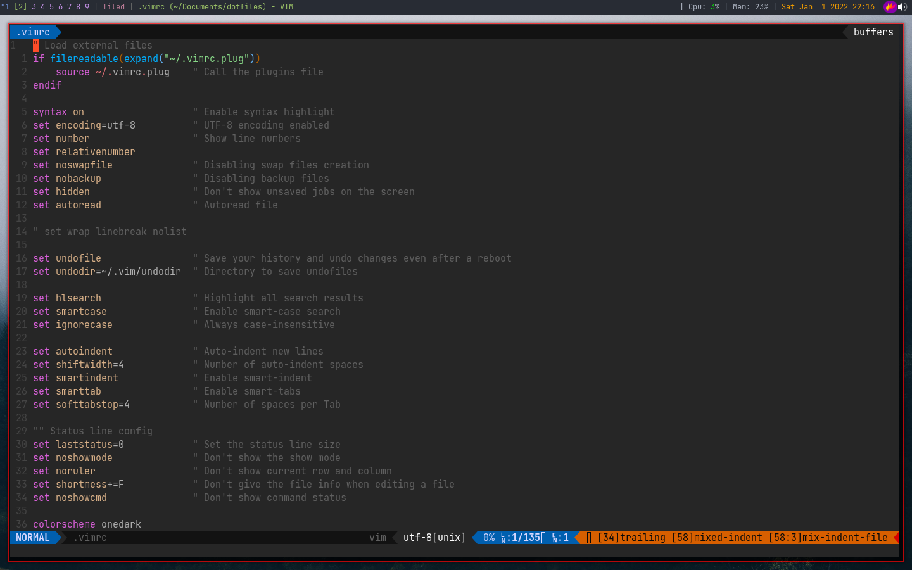

# My personal dotfiles for Arch Linux

# Contents

- vim config
- shell config
- tmux config
- rofi config
- terminator
- sxhkd
- fonts
- xinit

# Window manager configs

- [dwm](https://github.com/H3llHammer/dwm)
- [qtile](https://github.com/H3llHammer/dotfiles/tree/main/.config/qtile) Deprecated

# Vim setup

- [vim-plug](https://github.com/junegunn/vim-plug) - A minimalist Vim plugin manager
- vim-airline - vim-airline-themes - nerdtree

  - fzf
  - vim-gitgutter
  - floaterm
  - coc.nvim
  - vim-rainbow
  - vim-javascript
  - typescript-vim
  - vim-jsx-pretty
  - vim-jsx-typescript
  - styled-components-components
  - vim-snippets

- coc-extensions
  - coc-tailwindcss
  - coc-snippets
  - coc-prettier
  - coc-html-css-support
  - coc-html
  - coc-eslint
  - coc-tsserver
  - coc-sql
  - coc-sh
  - coc-react-refactor
  - coc-python
  - coc-pyright
  - coc-phpls
  - coc-java
  - coc-css

### Keys

Leader: `space`

| Shortcut     | Description                |
| ------------ | -------------------------- |
| `<leader>q`  | Close the current buffer.  |
| `<leader>w`  | Save the current buffer.   |
| `<leader>!`  | Close without save.        |
| `<S-Tab>`    | Switch between buffers.    |
| `<leader>bn` | Switch to next buffer.     |
| `<leader>bp` | Switch to previous buffer. |
| `<leader>bd` | Remove current buffer.     |
| `<C-t>`      | Toggle NERDTree.           |
| `<leader>go` | Toggle GitGutter.          |
| `gd`         | coc-definition.            |
| `gy`         | coc-type-definition.       |
| `gi`         | coc-implementation.        |
| `gr`         | coc-references.            |

# Shell setup

## Zsh

- [powerlevel10k](https://github.com/romkatv/powerlevel10k)
- [Nerd Fonts](https://www.nerdfonts.com/) - JetBrainsMono Nerd Font

## Fish
